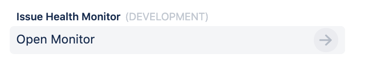
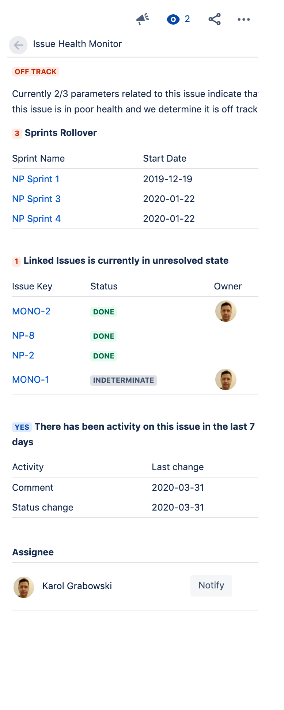

# Issue Health

 

## Description

This Forge app provides insight into the health of Jira issues. The app determines issue health using
the number of unresolved issues linked, number of days without updates, and how many sprints have contained the issue.

### Issue Glance

The app adds the *Open Issue Health Monitor* button using an 
[issue glance](https://developer.atlassian.com/platform/forge/manifest-reference/#jira-issue-glance)
which displays alongside fields such as Assignee and Labels.

Clicking on the issue glance button opens a panel that displays the issue's health using Forge UI.

## Installation

If this is your first time using Forge, the
[getting started](https://developer.atlassian.com/platform/forge/set-up-forge/)
guide will help you install the prerequisites.

If you already have a Forge environment set up, you can deploy this example straight
away. Visit the [example apps](https://developer.atlassian.com/platform/forge/example-apps/)
page for installation steps.

## Usage

Issue health uses the Jira Software sprint custom field, if enabled. Without it
the app will only check for blocker issues and issue age.

To enable the Jira Software sprint custom field:

1. Choose **Jira Settings** > **Issues**.
1. Select **Fields** > **Custom Fields**.
1. Ensure the **Sprint** *(Jira Software sprint field)* is enabled.

## Documentation

The app's [manifest.yml](./manifest.yml) contains two modules:

1. A [jira:issueGlance module](https://developer.atlassian.com/platform/forge/manifest-reference/#jira-issue-glance)
that specifies the metadata displayed to the user using a [Glance](https://developer.atlassian.com/cloud/jira/platform/modules/issue-glance/) in the Jira Issue View. The `jira:issueGlance` uses the following fields:
  
    * `title` displayed above glance button.
    * `label` displayed on glance button.
    * `status` lozenge displaying ">>".

1. A corresponding [function module](https://developer.atlassian.com/platform/forge/manifest-reference/#function)
that implements the issue glance logic.

The function logic is implemented in two files:

* [src/index.jsx](./src/index.jsx): Contains the main logic and UI elements of the app.
* [src/helpers.js](./src/helpers.js): Contains helper functions.

The app's UI is implemented using these features:

- [`IssueGlance`](https://developer.atlassian.com/platform/forge/ui-components/issue-glance) component
- [`Avatar`](https://developer.atlassian.com/platform/forge/ui-components/avatar) component
- [`AvatarStack`](https://developer.atlassian.com/platform/forge/ui-components/avatar-stack) component
- [`Button`](https://developer.atlassian.com/platform/forge/ui-components/button) component
- [`Text`](https://developer.atlassian.com/platform/forge/ui-components/text) component
- [`ModalDialog`](https://developer.atlassian.com/platform/forge/ui-components/modal-dialog) component
- [`Form`](https://developer.atlassian.com/platform/forge/ui-components/form) component
- [`Lozenge`](https://developer.atlassian.com/platform/forge/ui-components/lozenge) component
- [`Table`](https://developer.atlassian.com/platform/forge/ui-components/table) component
- [`useState`](https://developer.atlassian.com/platform/forge/ui-hooks-reference/#usestate)
- [`useProductContext`](https://developer.atlassian.com/platform/forge/ui-hooks-reference/#useproductcontext)

## Contributions

Contributions to Issue Health are welcome! Please see [CONTRIBUTING.md](CONTRIBUTING.md) for details.

## License

Copyright (c) 2020 Atlassian and others.
Apache 2.0 licensed, see [LICENSE](LICENSE) file.
