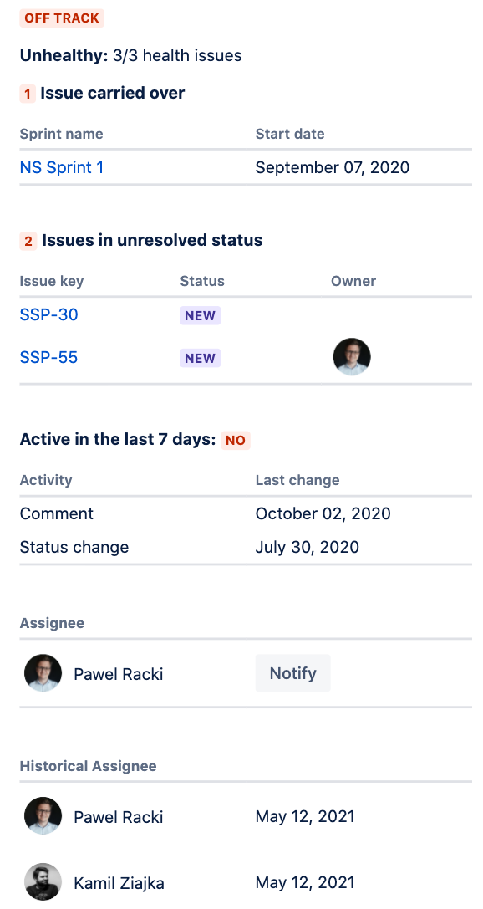

# Issue Health

 

## Description

As a TL/PM/Scrum Master, I want to be able to quickly identify the risk of given
task based on different stats (eg. how many days the issue was not updated, how many
sprints had the task been in) so that I can escalate or refine the risky tasks.

### Issue Glance

This Forge app adds the *issue health management* button using an
[issue glance](https://developer.atlassian.com/platform/forge/manifest-reference/#jira-issue-glance)
which is placed alongside fields such as Assignee and Labels. Clicking the button
opens the content provided by the Forge app, so that it fills the right sidebar.

### Issue Glance panel

Clicking on the issue glance button opens a panel with the Forge app's UI. Here the
app can display the details for this issues health.

## Installation

If this is your first time using Forge, the
[getting started](https://developer.atlassian.com/platform/forge/set-up-forge/)
guide will help you install the prerequisites.

If you already have a Forge environment setup you can deploy this example straight
away. Visit our [example apps](https://developer.atlassian.com/platform/forge/example-apps/)
page for installation steps.

## Usage

Issue Health is using Jira Software sprint custom field. To have full functionality
working it need to be available.

The issue health app uses the Jira Software sprint custom field. Without it the
app will only check for blocker issues and issue age.

To check if Jira Software sprint custom field is enabled:

1. Choose **Jira Settings** > **Issues**.
1. Select **Fields** > **Custom Fields**.
1. Ensure the **Sprint** *(Jira Software sprint field)* is enabled.

### Get the custom field ID for your instance

Each instance of Jira has a different id for given custom field. You may need to update
this example app code with your instances custom field ID before you can access sprint values.

1. Use the Jira REST API to get the custom field IDs from an existing issue.
  `https://example.atlassian.net/rest/api/3/issue/<issue-key>?expand=versionedRepresentations`
1. From the returned JSON find the `customfield_<id>` with your sprint details.
1. Then in `index.jsx` code replace `customfield_10020` on line 23 with your custom field ID.

If you have not worked with the Jira REST API, see the [Jira reference docs](https://developer.atlassian.com/cloud/jira/platform/rest/v3/) where you can explore the APIs with Postman.

## Documentation

The app's [manifest.yml](./manifest.yml) contains two modules:

* A [jira:issueGlance module](https://developer.atlassian.com/platform/forge/manifest-reference/#jira-issue-glance)
that specifies the metadata displayed to the user using a [Glance](https://developer.atlassian.com/cloud/jira/platform/modules/issue-glance/) in the Jira Issue View.

  The `jira:issueGlance` uses the following fields:
  * title: displayed above glance button
  * label: displayed on glance button
  * status: lozenge displaying ">>"

* A corresponding [function module](https://developer.atlassian.com/platform/forge/manifest-reference/#function)
that implements the issue glance logic.

The function logic is implemented in two files:

* main logic: [src/index.jsx](./src/index.jsx),
* helpers functions: [src/helpers.js](./src/helpers.js),

The app's UI is implemented using these features:

- [`Text`](https://developer.atlassian.com/platform/forge/ui-components/text) component.
- [`Button`](https://developer.atlassian.com/platform/forge/ui-components/button) component.
- [`useState`](https://developer.atlassian.com/platform/forge/ui-hooks-reference/#usestate)
- [`useProductContext`](https://developer.atlassian.com/platform/forge/ui-hooks-reference/#useproductcontext)

## Contributions

Contributions to Issue Health are welcome! Please see [CONTRIBUTING.md](CONTRIBUTING.md) for details.

## License

Copyright (c) 2020 Atlassian and others.
Apache 2.0 licensed, see [LICENSE](LICENSE) file.
